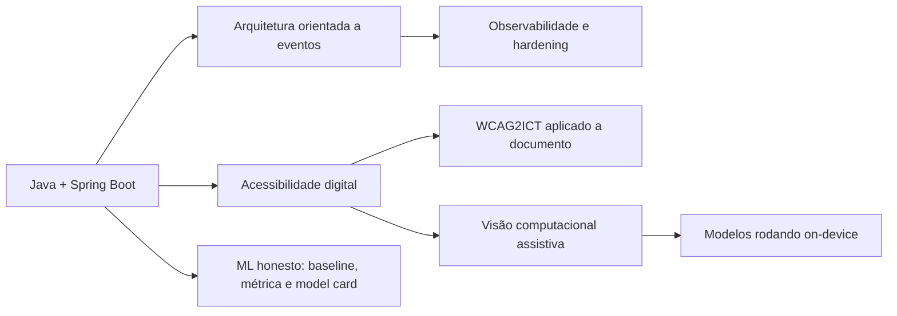

# Samuel Madeiro

**Java Backend · Visão Computacional aplicada a Acessibilidade**

**[Sobre](#-sobre) · [Stack](#-stack) · [Projetos](#-projetos) · [Como eu trabalho](#-como-eu-trabalho) · [Roadmap](#-roadmap) · [Contato](#-contato)**

---

## 🧭 Sobre

Salve! 👋 Sou Samuel, estudante de Ciência da Computação na UNIESP. Construo backend em Java e sistemas
de visão computacional aplicados a acessibilidade.

Meus projetos tendem a nascer de um problema concreto: alguém precisa decidir se
compra um negócio, alguém não consegue usar o computador com as mãos, alguém
precisa que a máquina entenda Libras. **O código vem depois do problema.**

---

## 🛠 Stack

**💻 Desenvolvimento**

  
  
  
  
  
  
  
  
  

**🐳 Infraestrutura e DevOps**

  
  
  
  
  
  
  

**🧰 Ferramentas**

  
  
  
  
  
  

---

## 🚀 Projetos

### ♿ Acessibilidade

#### [AccessAI](https://github.com/samuelmadeiro/accessai)

  
  
  
  
  

Audita a acessibilidade de documentos `.docx` e devolve um score explicável: cada
ponto perdido rastreia até um problema com evidência e critério WCAG. O
concorrente existe — o Verificador de Acessibilidade do Word — e a resposta é que
ele não tem API, não roda em lote, não dá nota e não cita norma.

- **Regras determinísticas citando WCAG2ICT**, a norma do W3C para documento
  não-web. Nenhuma regra escreve critério em código: tudo vem de uma tabela
  versionada, e critério marcado como inaplicável não pode gerar violação —
  validado no build, não por convenção
- **Score por princípio POUR**, com renormalização quando um princípio não tem
  regra implementada. Dar 100 a uma categoria que o sistema não verifica seria
  afirmar conformidade inexistente
- **Extração OOXML por XML direto, sem Apache POI.** O POI devolve zero imagens
  para desenho dentro de `mc:AlternateContent` — falso negativo silencioso, que
  num produto de score significa aprovar documento inacessível
- **Outbox transacional, retry com backoff e DLT.** Publica, espera a confirmação
  do broker, e só então marca; a ordem inversa transformaria falha de rede em
  evento perdido em silêncio
- **Isolamento por linha provado por teste:** o usuário A recebe 404 — não 403 —
  ao pedir a análise do usuário B, porque 403 confirmaria que o id existe
- **Não há modelo de ML treinado, e o sistema diz isso.** Toda predição de
  qualidade de alt text sai com `usouHeuristica: true`, e o treino se recusa a
  exportar artefato sobre rótulo não revisado
- **Guardrail de IA nas duas pontas:** pergunta que cita critério não verificado é
  recusada, e recomendação que cita regra ausente da análise é descartada. Prompt
  injection tratado em quatro camadas — o conteúdo do documento é hostil

#### [Reconhecimento de Libras](https://github.com/samuelmadeiro/libras-reconhecimento)

  
  
  
  

Reconhece sinais de Libras pela câmera, incluindo as letras que só existem
enquanto movimento (H, J, K, X, Z). Cada sinal é tratado como sequência temporal,
não como pose isolada.

- Normalização invariante a posição e escala que **preserva a trajetória** —
  normalizar frame a frame resolveria a invariância e apagaria o movimento
- Reamostragem para comprimento fixo e classificação KNN ponderada por distância
- SQLite guardando o dado processado **e** o bruto, o que permite reprocessar o
  banco inteiro ao mudar a normalização sem recoletar nada
- Formato binário próprio para troca de sinais entre desktop e celular
- App Android nativo executando o mesmo algoritmo on-device

#### [Comunicador Ocular](https://github.com/samuelmadeiro/comunicador-ocular)

  
  
  

Controle do computador pelo olhar com webcam comum, boca como clique. Para
pessoas sem fala e sem movimento dos membros.

- **Filtro One Euro implementado à mão:** corte adaptativo à velocidade, firme
  parado e responsivo em movimento, sem o atraso de um filtro de corte fixo
- Regressão ridge sobre features polinomiais incluindo a pose da cabeça — a
  regressão aprende o acoplamento entre cabeça e olhar em vez de assumi-lo
- Calibração indexada por perfil e resolução, reaproveitando amostras anteriores
- Backend Spring Boot com REST e SQLite guardando o modelo ajustado e os dados que
  o originaram

### 💰 Backend e decisão financeira

#### [Valor Justo](https://github.com/samuelmadeiro/valorjusto)

  
  
  
  

Avalia se vale a pena comprar uma empresa à venda no Brasil. Recebe a URL do
anúncio ou os números à mão e devolve um índice de 0 a 100 com o fluxo de caixa
por trás: VPL, TIR, payback e os critérios eliminatórios.

- Valuation com custo de capital, financiamento, capital de giro e saída
- PostgreSQL com cadastro em JSONB, SQL explícito **sem JPA**
- Importação por URL com allowlist de domínio contra SSRF
- Consulta de CNPJ em três fontes da Receita em paralelo
- Paywall por créditos com pagamento reconferido na API do gateway, nunca só no
  webhook
- CI a cada push: testes, smoke test de contrato por rota, build das imagens e
  verificação de que nenhum `<script>` inline voltou ao front

### 📚 Estudos

  
  

---

## 🧪 Como eu trabalho

O que aparece nos repositórios acima, e que vale mais que a lista de tecnologias:

| Prática | O que significa na prática |
|---|---|
| **ADR por decisão** | Cada escolha estrutural tem um arquivo com contexto, alternativas descartadas e condição de reabertura. Decisão sem dono no plano não acontece |
| **Fatias verticais** | Uma fatia fina atravessando o sistema inteiro por vez, commitada e verde antes da próxima — nunca "todo o backend, depois todo o ML" |
| **O sistema declara o que ele não sabe** | `usouHeuristica: true`, `procedencia: FIXTURE`, `naoAvaliados` na resposta. Um número sem rastro de como foi obtido é pior que número nenhum |
| **Teste no lugar de disciplina** | Invariante de arquitetura travada por ArchUnit, isolamento provado por 404 cruzado, e regra de arquitetura que ninguém viu falhar não prova nada |
| **Limitação escrita** | Todo README tem a seção do que ainda não funciona. Gap medido e publicado é assunto de conversa; gap escondido é mentira |

## 🗺 Roadmap

---

## 📫 Contato

  

*"Prefira entregar menos e verdadeiro."*

